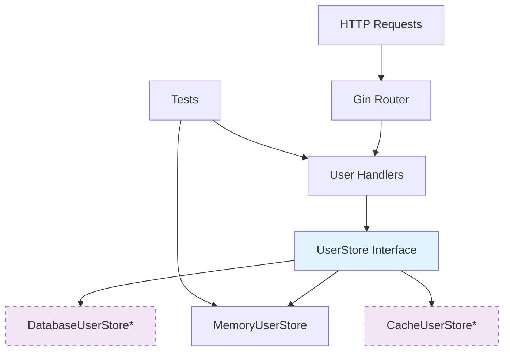

# 🚀 Go API Starter Project

A production-ready Go web service starter template featuring clean architecture, comprehensive testing, and scalable design patterns. Built with modern Go practices and industry-standard tools.

[](https://golang.org)
[](./coverage.html)
[](LICENSE)

## 🎯 What Is This?

This project serves as a **comprehensive starter template** for building scalable Go web services. It demonstrates:

- **Clean Architecture** with dependency injection
- **Comprehensive Testing Strategy** (unit, integration, performance)
- **Production-Ready Patterns** for real-world applications
- **Scalable Design** that grows with your needs
- **Industry Best Practices** from the Go community

Perfect for developers who want to start with a solid foundation rather than building everything from scratch.

## ✨ Key Features

### 🏗️ **Architecture**
- **Clean separation** of concerns (handlers, business logic, data layer)
- **Dependency injection** for testability and flexibility
- **Interface-driven design** for easy extension and testing
- **Thread-safe operations** with proper concurrency handling

### 🧪 **Testing Excellence**
- **100% test coverage** on critical components
- **Table-driven tests** for comprehensive scenario coverage
- **Mock-based testing** for isolated unit tests
- **Integration tests** with real HTTP workflows
- **Performance benchmarks** and race condition detection

### 🛠️ **Developer Experience**
- **Hot reload** development setup
- **Automated testing** with comprehensive Makefile
- **API documentation** with Swagger/OpenAPI
- **Code quality tools** integration ready

### 📈 **Production Ready**
- **Structured logging** with Gin middleware
- **Error handling** with consistent HTTP responses
- **Performance optimized** with benchmark validation
- **Concurrent access** safely handled

## 🚀 Quick Start

### Prerequisites
- Go 1.21 or higher
- Git

### Installation & Setup

```bash
# Clone or download this template
git clone <your-repo-url>
cd go-api-example

# Generate Open API docs
make docs

# Install dependencies
make deps

# Run tests to verify setup
make test

# Start development server
make run
```

The API will be available at `http://localhost:8080`

### 🔍 **Verify Installation**

```bash
# Check API health
curl http://localhost:8080/api/v1/users

# View interactive API documentation
open http://localhost:8080/swagger/index.html
```

## 📁 Project Structure

```
├── handlers/                   # HTTP request handlers
│   ├── users.go               # User endpoint implementations
│   └── users_test.go          # Handler unit & integration tests
├── store/                     # Data access layer
│   ├── user.go               # User model & store interface
│   ├── memory.go             # In-memory store implementation
│   └── memory_test.go        # Store tests with benchmarks
├── docs/                     # Auto-generated API documentation
│   ├── docs.go              # Swagger documentation
│   ├── swagger.json         # OpenAPI spec
│   └── swagger.yaml         # YAML format spec
├── main.go                  # Application entry point
├── Makefile                # Development & CI automation
├── go.mod                  # Go module definition
├── TESTING.md             # Comprehensive testing guide
└── README.md              # This file
```

### 🏛️ **Architecture Layers**



*Future implementations

## 🛠️ API Reference

### User Management Endpoints

| Method | Endpoint | Description | Status |
|--------|----------|-------------|---------|
| `GET` | `/api/v1/users` | List all users | ✅ |
| `GET` | `/api/v1/users/{id}` | Get user by ID | ✅ |
| `POST` | `/api/v1/users` | Create new user | ✅ |
| `PUT` | `/api/v1/users/{id}` | Update user | ✅ |
| `DELETE` | `/api/v1/users/{id}` | Delete user | ✅ |

### 📝 **Example Usage**

```bash
# Create a user
curl -X POST http://localhost:8080/api/v1/users \
  -H "Content-Type: application/json" \
  -d '{"name":"John Doe","email":"john@example.com"}'

# Get all users
curl http://localhost:8080/api/v1/users

# Get specific user
curl http://localhost:8080/api/v1/users/1

# Update user
curl -X PUT http://localhost:8080/api/v1/users/1 \
  -H "Content-Type: application/json" \
  -d '{"name":"Jane Doe","email":"jane@example.com"}'

# Delete user
curl -X DELETE http://localhost:8080/api/v1/users/1
```

### 📋 **API Response Format**

```json
// Success Response
{
  "id": 1,
  "name": "John Doe",
  "email": "john@example.com"
}

// Error Response
{
  "error": "User not found"
}
```

## 🧪 Testing

This project demonstrates comprehensive testing practices for Go web services.

### 📊 **Test Coverage**
- **Store Package**: 100% coverage
- **Handler Package**: 62.5% coverage
- **Integration Tests**: Full CRUD workflows
- **Performance Tests**: Benchmark all operations

### 🏃‍♂️ **Running Tests**

```bash
# Run all tests
make test

# Run specific test categories
make test-unit          # Unit tests only
make test-integration   # Integration tests
make test-coverage     # Generate coverage report
make benchmark         # Performance benchmarks
make test-race         # Race condition detection

# Run specific packages
go test ./store/...     # Store tests only
go test ./handlers/...  # Handler tests only
```

### 📈 **Performance Benchmarks**

```
BenchmarkMemoryUserStore_Create-16        3,810,510    355.1 ns/op    277 B/op    1 allocs/op
BenchmarkMemoryUserStore_GetByID-16      39,203,636     30.53 ns/op     48 B/op    1 allocs/op
BenchmarkMemoryUserStore_GetAll-16           95,047     11,200 ns/op  40,960 B/op    1 allocs/op
```

See [TESTING.md](./TESTING.md) for detailed testing documentation.

## 🔧 Development

### 🛠️ **Available Commands**

```bash
# Development
make dev            # Start development server (alias for run)
make run            # Build and run the application
make build          # Build binary executable

# Testing & Quality
make test           # Run all tests
make test-coverage  # Generate HTML coverage report
make benchmark      # Run performance benchmarks
make test-race      # Test with race detection
make lint           # Run code linting (installs golangci-lint)

# Documentation
make docs           # Generate/update Swagger documentation

# Maintenance
make deps           # Install/update dependencies
make clean          # Clean build artifacts and test cache
make ci             # Run full CI pipeline (deps, test, race, coverage, lint)
```

### 🔄 **Development Workflow**

1. **Add new features**:
   ```bash
   # Create feature branch
   git checkout -b feature/new-endpoint
   
   # Develop with hot reload
   make run
   ```

2. **Write tests first** (TDD approach):
   ```bash
   # Add tests
   # Run tests frequently
   make test-unit
   ```

3. **Verify quality**:
   ```bash
   # Full test suite
   make ci
   ```

4. **Update documentation**:
   ```bash
   # Regenerate API docs
   make docs
   ```

## 🏗️ Extending the Project

### 🗄️ **Adding Database Support**

1. **Create database implementation**:
   ```go
   // store/postgres.go
   type PostgresUserStore struct {
       db *sql.DB
   }
   
   func (p *PostgresUserStore) GetAll() ([]User, error) {
       // Implementation
   }
   ```

2. **Update main.go**:
   ```go
   // Switch implementations
   userStore := store.NewPostgresUserStore(db)
   ```

3. **Add tests**:
   ```go
   // store/postgres_test.go
   func TestPostgresUserStore_Integration(t *testing.T) {
       // Integration tests with test database
   }
   ```

### 📊 **Adding New Endpoints**

1. **Define in handlers**:
   ```go
   // handlers/users.go
   func (h *UserHandler) SearchUsers(c *gin.Context) {
       // Implementation with store interface
   }
   ```

2. **Add route in main.go**:
   ```go
   v1.GET("/users/search", userHandler.SearchUsers)
   ```

3. **Write comprehensive tests**:
   ```go
   // handlers/users_test.go
   func TestUserHandler_SearchUsers(t *testing.T) {
       // Table-driven tests
   }
   ```

### 🔌 **Adding Middleware**

```go
// middleware/auth.go
func AuthMiddleware() gin.HandlerFunc {
    return func(c *gin.Context) {
        // Authentication logic
        c.Next()
    }
}

// main.go
v1.Use(middleware.AuthMiddleware())
```

## 📦 Dependencies

### Core Dependencies
- **[Gin](https://github.com/gin-gonic/gin)** - HTTP web framework
- **[Swaggo](https://github.com/swaggo/swag)** - API documentation generation

### Testing Dependencies  
- **[Testify](https://github.com/stretchr/testify)** - Testing toolkit with assertions and mocks

### Development Dependencies
- **[golangci-lint](https://github.com/golangci/golangci-lint)** - Code quality and linting

All dependencies are pinned to stable versions for reliability.

## 🚢 Deployment

### 🐳 **Docker Support**

```dockerfile
# Dockerfile (example)
FROM golang:1.21-alpine AS builder
WORKDIR /app
COPY go.mod go.sum ./
RUN go mod download
COPY . .
RUN go build -o api-server main.go

FROM alpine:latest
RUN apk --no-cache add ca-certificates
WORKDIR /root/
COPY --from=builder /app/api-server .
EXPOSE 8080
CMD ["./api-server"]
```

### ☸️ **Kubernetes Deployment**

```yaml
# k8s/deployment.yaml (example)
apiVersion: apps/v1
kind: Deployment
metadata:
  name: go-api
spec:
  replicas: 3
  selector:
    matchLabels:
      app: go-api
  template:
    metadata:
      labels:
        app: go-api
    spec:
      containers:
      - name: api
        image: go-api:latest
        ports:
        - containerPort: 8080
```

### 🔄 **CI/CD Pipeline**

```yaml
# .github/workflows/ci.yml (example)
name: CI/CD Pipeline
on: [push, pull_request]

jobs:
  test:
    runs-on: ubuntu-latest
    steps:
    - uses: actions/checkout@v4
    - uses: actions/setup-go@v4
      with:
        go-version: '1.21'
    - run: make ci
    - run: make build
```

## 🎯 Design Philosophy

### 🧠 **Principles**

1. **Interface Segregation** - Small, focused interfaces
2. **Dependency Inversion** - Depend on abstractions, not concretions  
3. **Single Responsibility** - Each component has one clear purpose
4. **Open/Closed** - Open for extension, closed for modification
5. **Test-Driven** - Tests guide design and catch regressions

### 📐 **Patterns Used**

- **Repository Pattern** - `UserStore` interface abstracts data access
- **Dependency Injection** - Components receive dependencies, don't create them
- **Table-Driven Testing** - Comprehensive test scenarios with minimal code
- **Factory Pattern** - Constructor functions for clean initialization
- **Middleware Pattern** - Composable request processing

### 🎨 **Code Style**

- **Go Standards** - Following official Go conventions
- **Clear Naming** - Self-documenting code with meaningful names
- **Error Handling** - Explicit error handling at every level
- **Documentation** - Comprehensive comments and examples

## 🤝 Contributing

We welcome contributions! This starter template benefits from community improvements.

### 📋 **Guidelines**

1. **Fork & Clone** the repository
2. **Create feature branch**: `git checkout -b feature/amazing-feature`
3. **Write tests first** for new functionality
4. **Ensure all tests pass**: `make ci`
5. **Update documentation** if needed
6. **Submit pull request** with clear description

### 🧪 **Contribution Checklist**

- [ ] Tests added for new functionality
- [ ] All existing tests pass (`make test`)
- [ ] No race conditions (`make test-race`)
- [ ] Documentation updated
- [ ] Code follows Go conventions
- [ ] Commit messages are clear

## 📄 License

This project is licensed under the MIT License - see the [LICENSE](LICENSE) file for details.

## 🙏 Acknowledgments

- **Go Team** - For creating an excellent language and toolchain
- **Gin Framework** - For the lightweight, fast HTTP framework
- **Testify** - For making Go testing more enjoyable
- **Go Community** - For best practices and patterns demonstrated here

## 🔗 Resources

### 📚 **Learning Resources**
- [Effective Go](https://golang.org/doc/effective_go.html) - Official Go best practices
- [Go Code Review Comments](https://github.com/golang/go/wiki/CodeReviewComments) - Style guide
- [Advanced Go Patterns](https://www.ardanlabs.com/) - Advanced techniques

### 🛠️ **Tools & Libraries**
- [Awesome Go](https://github.com/avelino/awesome-go) - Curated Go resources
- [Go Report Card](https://goreportcard.com/) - Code quality analysis
- [pkg.go.dev](https://pkg.go.dev/) - Go package documentation

---

**Ready to build something amazing?** 🚀

This starter template gives you a solid foundation. Focus on your business logic while we handle the boilerplate, testing, and architectural patterns.

Star ⭐ this repository if it helps you build better Go services!